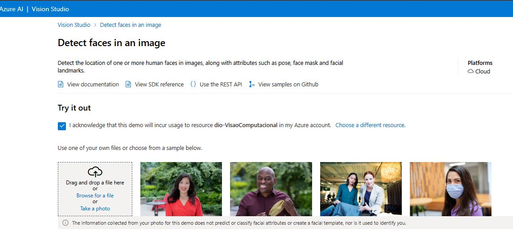

# AI-900 - Visão Computacional
Bootcamp Microsoft Azure AI-900, Visão Computacional

1. Crie um novo repositório no github com um nome a sua preferência
2. Crie uma pasta chamada 'inputs' e salve as imagens que você utilizou
3. Crie uma pasta chamado 'output' e salve os resultados de reconhecimento de texto nessas imagens
4. Crie um arquivo chamado readme.md , deixe alguns prints descreva o processo, alguns insights e possibilidades que você aprendeu durante o conteúdo.
5. Compartilhe conosco o link desse repositório através do botão 'entregar projeto'

Aqui está um exemplo de README em Markdown, seguindo os tópicos e regras que você mencionou:

---

# 🚀 Bootcamp Microsoft Azure AI-900 - Visão Computacional

Este repositório é dedicado ao aprendizado sobre os recursos de Visão Computacional no Microsoft Azure, explorados no Bootcamp AI-900. Aqui, vamos mergulhar em ferramentas poderosas e intuitivas para análise de imagens no Vision Studio.

## 📋 Conteúdo

1. [Detect Faces in Vision Studio](#-detect-faces-in-vision-studio)
2. [Analyze Images in Vision Studio](#-analyze-images-in-vision-studio)
3. [Read Text in Vision Studio](#-read-text-in-vision-studio)

## 😎 Detect Faces in Vision Studio

A ferramenta **Detect Faces** no Vision Studio permite identificar rostos e analisar suas características em imagens. Ela oferece:

- **Detecção de Atributos**: Encontra detalhes como idade, emoções, gênero, orientação facial e até acessórios (ex: óculos). 🕶️
- **Personalização e Segurança**: Útil para criar experiências personalizadas, reforçar a segurança com reconhecimento facial e monitorar em tempo real. 📸

Essa ferramenta é excelente para quem quer automatizar processos que envolvem rostos e expressões!

---

## 📖 Read Text in Vision Studio

A ferramenta **Read Text** permite extrair texto impresso e manuscrito de imagens e documentos. Com ela, você pode:

- **Digitalizar Documentos**: Converte documentos físicos em texto digital de maneira prática e rápida. 📄
- **Interpretação em Tempo Real**: Identifica e lê textos em placas, sinalizações e outros conteúdos visuais. 📝

**Read Text** facilita a automação e acessibilidade em aplicações que precisam capturar e processar textos.

---

## 🌄 Analyze Images in Vision Studio

Com o **Analyze Images**, você pode extrair o conteúdo e o contexto de imagens com facilidade. Essa ferramenta é capaz de:

- **Identificação de Objetos e Cenas**: Detecta elementos como pessoas, animais e cenários naturais, gerando uma visão completa da imagem. 🏞️
- **Classificação Visual e Acessibilidade**: Cria descrições automáticas para imagens e facilita a organização e acessibilidade de conteúdos visuais. 👀

Ideal para enriquecer aplicações com inteligência visual e tornar a navegação mais acessível!

---

## 🚀 Começando

Para explorar essas ferramentas segue os links de tutorial e orientações detalhadas:

1. [Detect faces in Vision Studio](https://microsoftlearning.github.io/mslearn-ai-fundamentals/Instructions/Labs/04-face.html)

2.  [Read text in Vision Studio](https://microsoftlearning.github.io/mslearn-ai-fundamentals/Instructions/Labs/05-ocr.html)

3. [Analyze images in Vision Studio](https://microsoftlearning.github.io/mslearn-ai-fundamentals/Instructions/Labs/03-image-analysis.html) 

Se você está começando, não se preocupe! Cada uma dessas ferramentas é intuitiva e fornece suporte para iniciantes e profissionais.

---

### ✨Insights 

#### 😎 Detect Faces in Vision Studio

Não esquecer em "ticar" ✔ a caixa box ("I ackonowledge that this demo ..."), para que possa habilitar API, na identificação de pessoas na imagem.

* Para realizar o teste foi utilizado a imagem "[family.jpg](./inputs/detectFaces/family.jpg)"

* Resultado 

---

### 📖 Read Text in Vision Studio

---

#### 🌄 Analyze Images in Vision Studio