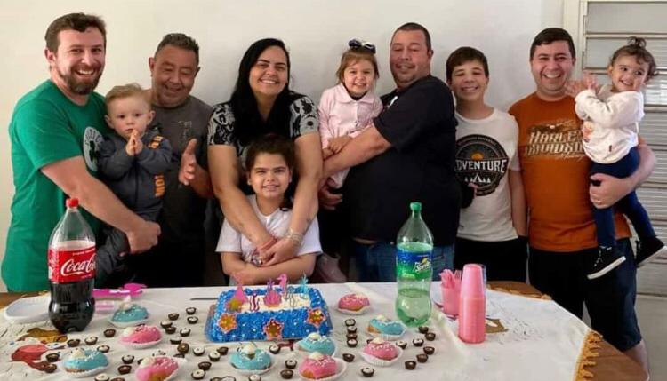
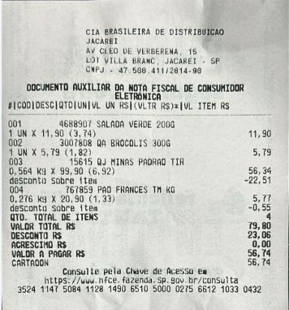
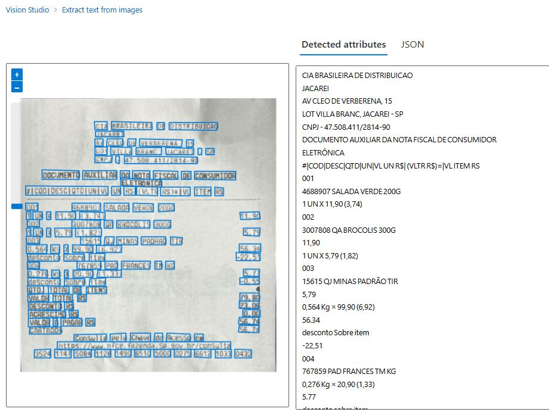
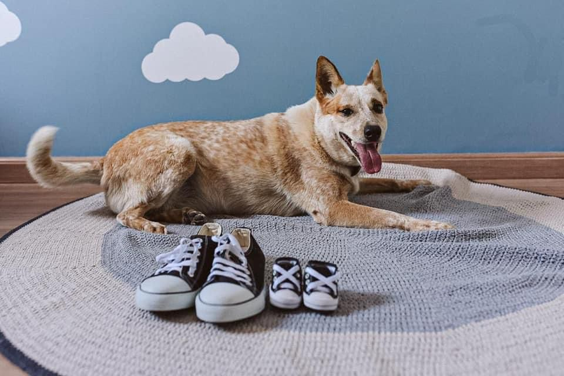

# 🚀 Bootcamp Microsoft Azure AI-900 - Visão Computacional

Este repositório é dedicado ao aprendizado sobre os recursos de Visão Computacional no Microsoft Azure, explorados no Bootcamp AI-900. Vamos explorar ferramentas poderosas para análise de imagens no Vision Studio e aprender como utilizá-las para tarefas práticas como detecção facial, leitura de texto e análise de imagens.

## 📋 Conteúdo

1. [Detect Faces in Vision Studio](#-detect-faces-in-vision-studio)
2. [Analyze Images in Vision Studio](#-analyze-images-in-vision-studio)
3. [Read Text in Vision Studio](#-read-text-in-vision-studio)

## 😎 Detect Faces in Vision Studio

A ferramenta **Detect Faces** no Vision Studio permite identificar rostos e analisar características em imagens, como:

- **Detecção de Atributos**: Analisa idade, emoções, gênero, orientação facial e acessórios (ex.: óculos). 🕶️
- **Personalização e Segurança**: Cria experiências personalizadas e reforça a segurança com reconhecimento facial. 📸

Essa ferramenta é excelente para automação de processos que envolvem rostos e expressões!

### Exemplo de Uso

1. Imagem de exemplo utilizada: "[family.jpg](./inputs/detectFaces/family.jpg)"

**Observação**: Para realizar o teste, marque ✔ a opção "I acknowledge that this demo may contain personal data", necessária para ativar a API de identificação de pessoas na imagem.

2. **Resultado**: [family_resultado.jpg](./inputs/detectFaces/family_resultado.jpg)

---

## 📖 Read Text in Vision Studio

A ferramenta **Read Text** permite extrair texto impresso e manuscrito de imagens e documentos, utilizando OCR (Reconhecimento Óptico de Caracteres). Com ela, você pode:

- **Digitalizar Documentos**: Converte documentos físicos em texto digital. 📄
- **Interpretação em Tempo Real**: Identifica e lê textos em sinalizações, placas e outros conteúdos visuais. 📝

Essa ferramenta facilita a automação e acessibilidade em aplicações que precisam capturar e processar textos.

### Exemplo de Uso

- Imagem de exemplo: [Nota Fiscal](./inputs/readText/nf.jpg)

- **Resultado**: [nf_resultado.jpg](./inputs/readText/nf_resultado.jpg)

---

## 🌄 Analyze Images in Vision Studio

Com o **Analyze Images**, você pode extrair conteúdo e contexto de imagens com facilidade. Essa ferramenta permite:

- **Identificação de Objetos e Cenas**: Detecta elementos como pessoas, animais e cenários naturais. 🏞️
- **Classificação Visual e Acessibilidade**: Gera descrições automáticas para imagens, ajudando na organização e acessibilidade de conteúdos visuais. 👀

Ideal para enriquecer aplicações com inteligência visual!

### Exemplo de Uso

- Imagem de teste da cachorra [Tequila](./inputs/analyzeImage/tequila.jpg).

- **Resultado**: [tequila_resultado.jpg](./inputs/analyzeImage/tequila_resultado.jpg)

---

## 🚀 Começando

Para explorar essas ferramentas, siga os tutoriais abaixo:

1. [Detect faces in Vision Studio](https://microsoftlearning.github.io/mslearn-ai-fundamentals/Instructions/Labs/04-face.html)
2. [Read text in Vision Studio](https://microsoftlearning.github.io/mslearn-ai-fundamentals/Instructions/Labs/05-ocr.html)
3. [Analyze images in Vision Studio](https://microsoftlearning.github.io/mslearn-ai-fundamentals/Instructions/Labs/03-image-analysis.html)

Cada ferramenta é intuitiva e fornece suporte tanto para iniciantes quanto para profissionais.

